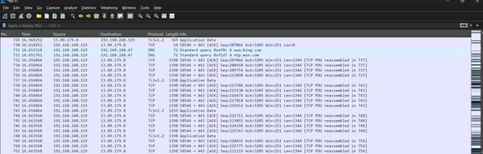
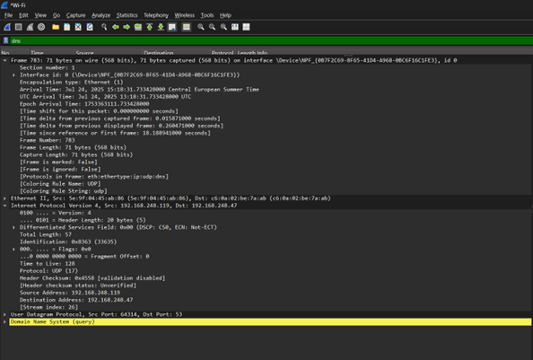

# Network Traffic Monitoring & Protocol Analysis

## Project Overview
This project demonstrates the use of **Wireshark** to capture and analyze real-time network traffic. By inspecting packet-level data, I validated protocol behaviors for DNS, TCP, and TLS, ensuring a deep understanding of how data moves across a network and how to identify potential security anomalies.

---

## 1. Traffic Identification
During the capture session, I identified several primary traffic types. Monitoring these protocols in action helped clarify how applications communicate over a network.

* **DNS (Domain Name System):** Analyzed queries from my laptop requesting website IP addresses and the corresponding server responses.
* **TLS (Transport Layer Security):** Confirmed encrypted web browsing sessions, verifying data privacy during transit.
* **TCP/UDP:** Analyzed the differences between connection-oriented (TCP) and connectionless (UDP) data transfers.

---

## 2. DNS Query & Response Analysis
I focused specifically on the DNS protocol to observe name resolution in real-time. 
* **Observation:** Captured the "Standard query" for a domain and the "Standard query response" containing the IP address.
* **Analysis:** Verified that the laptop correctly communicated with the DNS server to resolve hostnames before initiating TCP connections.

---

## 3. TCP 3-Way Handshake
I manually inspected the connection establishment process to verify network reliability:
1.  **SYN:** Initial synchronization request from the client.
2.  **SYN-ACK:** Acknowledgment from the server.
3.  **ACK:** Final acknowledgment to establish the connection.

---

## 4. Security Best Practices & Reflection
Based on the traffic analysis, I documented the following hardening requirements for organizational networks:
* **Encryption:** Enforcing TLS 1.2+ to prevent packet sniffing and Man-in-the-Middle (MITM) attacks.
* **Network Segmentation:** Utilizing VLANs and ACLs to limit the attack surface.
* **Monitoring:** Implementing IDS/IPS and SIEM systems for centralized logging and alert correlation.

---

## Tools Used
* **Wireshark:** Deep Packet Inspection (DPI) and protocol analysis.
* **Linux (Ubuntu):** Environment used for generating and capturing network traffic.
